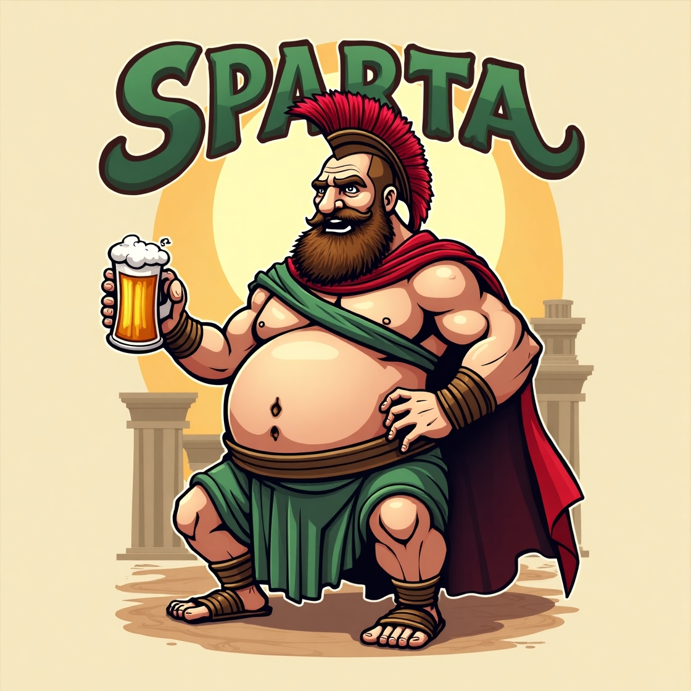

# 🎮 *Sparte : Si Léonidas N’avait Pas Existé*  
*Par le groupe LAPISARDI*

---

## 🧠 Idée de base

Alors voilà, l’idée m’est venue un peu en rigolant :  
> *"Et si les Spartiates étaient... nuls ?"*

Pas juste pas bons, mais vraiment nuls : maladroits, à côté de la plaque, plus préoccupés par les fêtes en taverne que par la guerre. Du coup, je me suis dit : pourquoi pas en faire un jeu RPG 3D avec un style cartoon bien décalé ?

L’objectif c’est pas de faire un truc historiquement cohérent (au contraire), mais plutôt de partir en freestyle total sur le mythe de Sparte.

### 🎯 Objectifs du jeu

- Gagner (ou pas) contre les Perses  
- Boire tout ce qui reste dans les tavernes  
- Inventer des “stratégies” (souvent foireuses) avec des guerriers pas foutus de tenir une lance  
- Éviter de détruire toutes les tavernes du coin, parce que quand même… faut bien se détendre après les combats

---

## 💡 Le nom & le style

J’ai testé pas mal de noms générés à l’arrache genre :

- *Les Spartiates déjantés*  
- *Léonidas le maladroit*  
- *La guerre des guignols*  
- *Spartiate en cavale*  
- etc.

Mais celui que j’ai gardé, c’est :  
## 👉 *Sparte : Si Léonidas N’avait Pas Existé*  
Parce que je trouvais qu’il plantait direct le décor. On part d’un "et si" improbable, et on pousse le délire jusqu’au bout.

### 🎨 Ambiance visuelle :

- Style **cartoon**, volontairement décalé  
- Couleurs vives, contrastées  
- Rien n’est sérieux, même les équipements des persos (genre bouclier en casserole, casque trop grand…)

Voici le logo, ça annonce la couleur, non ? :

---

## 🎭 Univers et direction artistique

L'idée c’est vraiment de casser l’image “ultra badass” qu’on a des Spartiates. Là, les persos sont :

- Pas musclés du tout  
- Avec une tête de linotte  
- En mode “je me suis habillé dans l’obscurité”  
- Et leurs attaques ? C’est du grand n’importe quoi (mention spéciale à la “roulade du tonneau”)

On est dans un monde où Sparte, au lieu d’être une machine de guerre, est une ville mal gérée par des types bourrés 80 % du temps. Ambiance “Kaamelott” version grecque, tu vois le délire.

---

## 📚 Le scénario (oui y'en a un)

### 🌍 Le pitch :

Léonidas n’a jamais existé. Du coup, personne pour former une vraie armée. Les Perses débarquent. Et Sparte… bah c’est la panique.

Au milieu de ce bazar : **Spartakos**, un genre de fermier maladroit qui devient “héros” par défaut.  
Spoiler : il n’y connaît rien.

### 🧑‍🤝‍🧑 Les persos principaux :

- **Spartakos** : le héros malgré lui (il voulait juste récupérer son mouton au départ)  
- **Le roi de Sparte** : complètement largué, il croit encore qu’un oracle va sauver la ville  
- **Xerxès** : lui il est sérieux, il veut juste envahir tranquille  
- **La prêtresse de la victoire** : donne des “conseils” (souvent inutiles ou foireux, genre “essaie de l’éblouir avec ton charisme”)

### 🧶 Le ton :

Humour absurde, situations débiles, dialogues qui partent en vrille. Un peu façon *Aventures* (de JDG & co), avec du second degré tout le temps.

---

## 🎵 Musique et ambiance sonore

Pour les musiques, j’ai imaginé plusieurs vibes :

- **Exploration tranquille / Grèce antique en touriste**  
  - Parfait pour quand tu te balades dans Sparte ou que tu fais un mini-jeu à la con
 - Exemples :
   - [Musique de fond 1](5.Musique/Musique_Fond_01.mp3) 
   - [Musique de fond 2](5.Musique/Musique_Fond_03.mp3)  
    
- **Moments de baston épique (ou presque)**  
  - Là on balance des percus, des cuivres… mais pas trop sérieux non plus
 - Exemples :
   - [Musique de Bataille 1](5.Musique/Musique_Bataille_01.mp3) 
   - [Musique de Bataille 2](5.Musique/Musique_Bataille_02.mp3)  

- **Victoire et festivités**  
  - Grosse ambiance taverne avec flûtes, chants bourrés, cris de joie  
  - Peut même changer en plein combat si tu tombes dans une taverne sans faire exprès
 - Exemples :
   - [Musique de victoire 1](5.Musique/Victory_01.mp3)
   - [Musique de victoire 1](5.Musique/Victory_01.mp3)

---

## 🧍 Modélisation 3D – Spartakos

J’ai commencé à bosser un peu le perso principal. Il est pas héroïque du tout : une faucille dans la main (oui, pour couper le blé), une tunique trop grande, et une démarche hésitante.

  

---

## 🎮 Gameplay & animations

### 🎮 Mouvements :

Les déplacements sont “fluides” mais avec un petit côté maladroit volontaire. Le perso peut trébucher, ou se cogner à des trucs. Tout doit être un peu exagéré.

### 🎬 Animations importantes :

- **Marche / Course / Saut / Roulade de la honte**  
- **Interactions maladroites** : renverse un vase en ramassant une pomme  
- **Réactions débiles** : cri de panique pour une chèvre  
- **Combat** : on tape mal, parfois à côté, parfois dans un poteau

---

## 🗂️ Organisation & ressources

Bon, là c’est la partie un peu plus sérieuse.

### 📁 Comment je range tout ça :

- Par type de contenu (images / sons / modèles / prompts, etc.)  
- Dossiers bien rangés pour pas s’y perdre  
- Guide de style pour que tout reste dans le ton cartoon/absurde

### 📝 Ce que je note pour documenter :

- Comment les idées sont venues  
- Les prompts utilisés (quand je m’appuie sur de l’IA)  
- Ce qui marche, ce qui galère  
- Ce que j’ai appris en chemin
